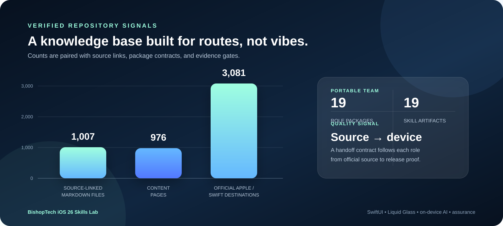
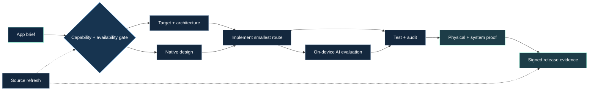

# iOS 26 Skills Lab

> Turn an LLM into a disciplined Apple-native engineering team.

An official-source-grounded knowledge base and portable skill bundle for building high-quality iOS apps with Swift, SwiftUI, Liquid Glass, Apple Intelligence, on-device AI, the wider Apple SDK, and Meta Wearables companion/display experiences.

<p align="center">
  <a href="docs/skills-catalog.md">Explore the skills</a> ·
  <a href="knowledge-base/README.md">Browse the knowledge base</a>
</p>

## The short version

Most AI coding workflows jump from an idea to a code snippet. This lab makes the missing engineering work explicit: capability selection, target and availability gates, native composition, privacy, AI evaluation, accessibility, physical-device proof, signing, and release evidence.

It is designed to help a solo developer work like a small, specialized Apple engineering team while keeping source claims, uncertainty, and proof requirements visible.

## Verified scale

| 1,007 | 976 | 3,081 | 19 | 19 |
| ---: | ---: | ---: | ---: | ---: |
| source-linked Markdown files | content pages | official Apple / Swift destinations | role packages | portable `.skill` artifacts |

The verified scale above is the original Apple lane. The Meta extension currently adds 30 route/source pages, twenty-three role packages, focused evaluation fixtures, and twenty-three portable `.skill` artifacts; it is tracked separately so the Apple baseline remains reproducible.

<p align="center">
  
</p>

## How a task moves



The orchestrator and every specialist package use the same handoff vocabulary: what was inspected, what the result proves, what it does not prove, and the smallest next gate.

## Choose your first route

| Your task | Start here | What you get |
| --- | --- | --- |
| Turn an app idea into a build plan | [Agentic Apple engineering team](knowledge-base/skills/packages/ios-agentic-apple-engineering-team/SKILL.md) | Role routing, source gates, handoffs, risks, and next action |
| Choose the right framework, target, or extension | [Apple SDK route](knowledge-base/skills/packages/apple-sdk-route/SKILL.md) | Capability matrix, lifecycle ownership, availability, permissions, and fallback |
| Make the UI feel native and adaptive | [SwiftUI native design](knowledge-base/skills/packages/swiftui-native-design/SKILL.md) | Screen states, navigation, Dynamic Type, accessibility, and preview coverage |
| Build restrained, functional Liquid Glass | [Liquid Glass design](knowledge-base/skills/packages/liquid-glass-design/SKILL.md) | Material roles, action hierarchy, transitions, reduced-effects fallback, and device review |
| Add private, reviewable on-device AI | [On-device AI feature](knowledge-base/skills/packages/on-device-ai-feature/SKILL.md) | Typed proposals, model readiness, refusal, user review, deterministic commits, and evaluation |
| Test, audit, and ship the real app | [Testing and release assurance](knowledge-base/skills/packages/ios-testing-and-release-assurance/SKILL.md) | Swift Testing, UI, accessibility, performance, device, archive, and TestFlight gates |
| Build an iOS + Meta Wearables experience | [Meta Wearables agentic team](knowledge-base/skills/packages/meta-wearables-agentic-team/SKILL.md) | Exact upstream-role roster, DAT/Web App route selection, camera/audio, Display/input/sensors, device proof, privacy, and source refresh |

For the complete purpose, feature set, outputs, and handoff of every role, open the [full skills catalog](docs/skills-catalog.md).

## The evidence ladder


These levels are not a vanity score. A simulator run does not establish accessory behavior; an archive does not establish accessibility; a model response does not establish correctness; a TestFlight upload does not establish production behavior. Use only the levels a claim actually requires.

## Apple role packages (19)

<details>
<summary><strong>Plan and route</strong> · 4 packages</summary>

- [Agentic Apple engineering team](knowledge-base/skills/packages/ios-agentic-apple-engineering-team/SKILL.md) — coordinate the complete brief-to-proof workflow.
- [Apple SDK route](knowledge-base/skills/packages/apple-sdk-route/SKILL.md) — map product outcomes to frameworks, APIs, system surfaces, and gates.
- [iOS capability route planner](knowledge-base/skills/packages/ios-capability-route-planner/SKILL.md) — select the capability lane before selecting an API.
- [Project, target, and module architect](knowledge-base/skills/packages/ios-project-target-architect/SKILL.md) — design the Xcode project graph and configuration boundaries.
</details>

<details>
<summary><strong>Native design</strong> · 3 packages</summary>

- [SwiftUI native design](knowledge-base/skills/packages/swiftui-native-design/SKILL.md) — design adaptive screens, states, navigation, and input behavior.
- [Liquid Glass design](knowledge-base/skills/packages/liquid-glass-design/SKILL.md) — use glass as functional hierarchy, not decorative blur.
- [Native design and Liquid Glass verification](knowledge-base/skills/packages/ios-native-design-verification/SKILL.md) — audit whether the implementation is actually native, legible, and accessible.
</details>

<details>
<summary><strong>Intelligence and inputs</strong> · 4 packages</summary>

- [On-device AI feature](knowledge-base/skills/packages/on-device-ai-feature/SKILL.md) — design typed, private, reviewable local intelligence.
- [On-device intelligence evaluation](knowledge-base/skills/packages/ios-on-device-intelligence-evaluation/SKILL.md) — measure quality, safety, availability, latency, energy, and model drift.
- [Media, ML, and physical inputs](knowledge-base/skills/packages/ios-media-ml-and-inputs/SKILL.md) — route camera, audio, Vision, Core ML, speech, NFC, and sensor pipelines.
- [Data and device services](knowledge-base/skills/packages/ios-data-and-device-services/SKILL.md) — handle SwiftData, CloudKit, HealthKit, contacts, locations, accessories, and sync truth.
</details>

<details>
<summary><strong>System and platform surfaces</strong> · 4 packages</summary>

- [System surfaces and background](knowledge-base/skills/packages/ios-system-surfaces-and-background/SKILL.md) — design widgets, intents, extensions, providers, deep links, and background work.
- [Companion and communications](knowledge-base/skills/packages/ios-companion-communications/SKILL.md) — route Watch, CarPlay, App Clips, calls, pushes, and notifications.
- [Spatial, graphics, and games](knowledge-base/skills/packages/ios-spatial-graphics-and-games/SKILL.md) — architect AR, RealityKit, Metal, SpriteKit, GameKit, and GPU-heavy work.
- [Commerce, identity, and security](knowledge-base/skills/packages/ios-commerce-identity-and-security/SKILL.md) — keep authentication, entitlements, payments, secrets, and trust boundaries explicit.
</details>

<details>
<summary><strong>Assurance and release</strong> · 4 packages</summary>

- [Privacy, performance, and release proof](knowledge-base/skills/packages/ios-privacy-performance-release-proof/SKILL.md) — inspect privacy, diagnostics, entitlements, archives, and distribution readiness.
- [Device and release proof](knowledge-base/skills/packages/ios-device-release-proof/SKILL.md) — define what source, simulator, hardware, signing, and TestFlight evidence establishes.
- [Testing and release assurance](knowledge-base/skills/packages/ios-testing-and-release-assurance/SKILL.md) — build deterministic tests, UI flows, accessibility audits, AI fixtures, and release gates.
- [Source refresh and availability](knowledge-base/skills/packages/ios-source-refresh-and-availability/SKILL.md) — refresh routes when Apple docs, SDKs, hardware, or policy changes.
</details>

## Meta Wearables extension team (23 packages)

The Meta lane is a source-grounded extension for native iOS and Android companion apps using the [Meta Wearables Device Access Toolkit](https://github.com/facebook/meta-wearables-dat-ios) and [DAT Android](https://github.com/facebook/meta-wearables-dat-android), plus separate [Ray-Ban Display Web Apps](https://wearables.developer.meta.com/docs/develop/webapps). It keeps DAT, native Display, Web Apps, MockDevice/browser simulation, and physical-glasses evidence distinct. The current public source snapshot does not establish a runtime mapping for “Gen 3”; use the exact `DeviceType`, capability response, firmware, and hardware result.

- [Meta Wearables agentic team](knowledge-base/skills/packages/meta-wearables-agentic-team/SKILL.md) — coordinate the exact specialist roster, handoffs, and evidence ledger.
- [Meta Wearables route planner](knowledge-base/skills/packages/meta-wearables-route-planner/SKILL.md) — choose native DAT, native Display, Web App, or phone fallback.
- [Meta DAT iOS integration](knowledge-base/skills/packages/meta-dat-ios-integration/SKILL.md) — integrate registration, permissions, sessions, and target configuration.
- [Meta DAT Android integration](knowledge-base/skills/packages/meta-dat-android-integration/SKILL.md) — integrate Maven artifacts, Kotlin lifecycle, Manifest/privacy configuration, and Android target proof.
- [Meta DAT Android API atlas](knowledge-base/skills/packages/meta-dat-android-api-atlas/SKILL.md) — map exact Android artifacts, Kotlin/Java symbols, 0.9 migrations, Display/MockDevice/debugging, and Android compile gates.
- [Meta Wearables developer operations](knowledge-base/skills/packages/meta-wearables-developer-operations/SKILL.md) — manage Developer Center organization/project/app identity, versions, channels, testers, telemetry, and recovery without leaking credentials or claiming release proof.
- [Meta Wearables transport and reliability](knowledge-base/skills/packages/meta-wearables-transport-reliability/SKILL.md) — audit Bluetooth/Wi-Fi/local-network, HFP/A2DP, backpressure, thermal, disconnect, and recovery behavior across iOS and Android.
- [Meta Wearables debugging and observability](knowledge-base/skills/packages/meta-wearables-debugging-observability/SKILL.md) — diagnose the first DAT failure through read-only live evidence and produce redacted diagnostic handoffs.
- [Meta Wearables input and sensors](knowledge-base/skills/packages/meta-wearables-input-sensors/SKILL.md) — keep native Display, Web App D-pad/EMG/temple input, browser/phone sensors, event epochs, privacy, and named-target proof distinct.
- [Meta Wearables security and attestation](knowledge-base/skills/packages/meta-wearables-security-attestation/SKILL.md) — keep iOS/Android identity tuples, callbacks, attestation, Developer Mode, release channels, package/signing secrets, and processing/review claims distinct.
- [Meta Wearables device compatibility](knowledge-base/skills/packages/meta-wearables-device-compatibility/SKILL.md) — resolve product labels, DAT/artifact revisions, firmware/companion tuples, version-dependency access, Gen 2 evidence, and Gen 3/regular-SDK uncertainty.
- [Meta Wearables full-SDK audit](knowledge-base/skills/packages/meta-wearables-full-sdk-audit/SKILL.md) — audit the complete public module/capability surface, machine-checked terminology contract, and source-conflict/evidence gates.
- [Meta device-generation matrix](knowledge-base/70-meta-wearables/16-device-generation-and-runtime-support-matrix.md) — separate consumer naming, SDK identity, runtime capabilities, and Gen 2/Gen 3 evidence.
- [Meta on-device compliance contract](knowledge-base/70-meta-wearables/17-on-device-compliance-and-runtime-contract.md) — separate glasses-native, phone-local, remote, mixed, and unknown processing with consent, lifecycle, thermal, storage, and fallback gates.
- [Meta DAT API atlas](knowledge-base/skills/packages/meta-dat-api-atlas/SKILL.md) — map release-anchored modules, symbols, samples, debugging, MCP, and DAT/Web App boundaries.
- [Meta DAT camera and audio](knowledge-base/skills/packages/meta-dat-camera-audio/SKILL.md) — model media streams, consent, lifecycle, and backpressure.
- [Meta DAT Display](knowledge-base/skills/packages/meta-dat-display/SKILL.md) — build capability-gated native glasses UI and input.
- [Meta Wearables Web Apps](knowledge-base/skills/packages/meta-wearables-web-apps/SKILL.md) — build the 600×600 public Web App surface for Ray-Ban Display.
- [Meta Wearables device proof](knowledge-base/skills/packages/meta-wearables-device-proof/SKILL.md) — run reproducible iOS/Android/Web App target preflight and separate source, mock, simulator, connected, physical, signed, and release evidence.
- [Meta Wearables privacy and publishing](knowledge-base/skills/packages/meta-wearables-privacy-publishing/SKILL.md) — audit permissions, consent, terms, data flow, and release gates.
- [Meta Wearables on-device compliance](knowledge-base/skills/packages/meta-wearables-on-device-compliance/SKILL.md) — enforce processing location, raw-data boundaries, thermal/lifecycle fallback, and honest on-device claims.
- [Meta Wearables operational readiness](knowledge-base/skills/packages/meta-wearables-operational-readiness/SKILL.md) — diagnose companion/firmware/on-glasses-DAT-app, mode/channel, thermal/power, provisioning, and bounded recovery behavior.
- [Meta Wearables application architecture](knowledge-base/skills/packages/meta-wearables-app-architecture/SKILL.md) — separate shared product state from iOS/Android/DAT/Web App adapters, fallbacks, concurrency, and test seams.
- [Meta Wearables reference implementation playbooks](knowledge-base/70-meta-wearables/28-reference-implementation-playbooks.md) — turn native Display, camera, audio-first, Web App, and shared-outcome requests into source/evidence-pinned vertical slices.
- [Meta Wearables implementation recipes](knowledge-base/skills/packages/meta-wearables-implementation-recipes/SKILL.md) — turn selected API rows and playbooks into source-aligned Swift, Kotlin/Java, and Web App scaffolding with compile/privacy/fallback gates.
- [Meta Wearables source refresh](knowledge-base/skills/packages/meta-wearables-source-refresh/SKILL.md) — maintain release, API, device, and access freshness.

Portable Meta artifacts are listed in the [workspace package index](knowledge-base/skills/packages/README.md).

## Give an LLM a real brief

Start the orchestrator with facts instead of a vague “build me an app” prompt:

```text
App idea:
Primary user and highest-consequence failure:
Target platforms and minimum OS:
Required Apple capabilities:
Data, privacy, account, and network boundaries:
On-device AI role, if any:
Known physical devices, accessories, and system surfaces:
Current project files, targets, schemes, and tests:
Desired evidence level:
```

Ask for a route decision, official sources, availability gates, implementation plan, test matrix, device/release proof plan, open uncertainties, and the smallest next verifiable step.

## Repository map

| Path | Purpose |
| --- | --- |
| [`knowledge-base/`](knowledge-base/README.md) | Source-linked Apple and Swift research organized by route and evidence. |
| [`knowledge-base/skills/packages/`](knowledge-base/skills/packages/README.md) | Human-readable role packages with references, fixtures, and handoff contracts. |
| [`knowledge-base/skills/dist/`](knowledge-base/skills/dist) | Portable `.skill` archives for agent workflows. |
| [`docs/skills-catalog.md`](docs/skills-catalog.md) | Purpose, features, outputs, and handoffs for every role. |
| [`docs/research-log.md`](docs/research-log.md) | Concise expansion record and refresh policy. |

## Source and safety boundary

The material paraphrases and routes official Apple and Swift documentation. It is not a replacement for SDK headers, Xcode diagnostics, current Apple Developer documentation, Human Interface Guidelines, legal advice, or actual device, account, App Store, or production evidence.

The project is review-ready, not approval-guaranteed. Apple platform behavior, availability, entitlements, privacy rules, hardware support, and release policies can change. Refresh the cited source and installed SDK before relying on a version-sensitive route.

## Share it

> An open-source Apple-native engineering team for LLMs, plus a source-grounded Meta Wearables extension for DAT, Ray-Ban Display Web Apps, device proof, and privacy-aware iOS companions.

## Contributing

Read [CONTRIBUTING.md](CONTRIBUTING.md), [SECURITY.md](SECURITY.md), and [CODE_OF_CONDUCT.md](CODE_OF_CONDUCT.md) before opening a pull request. Keep new routes source-linked, version-aware, scoped to the relevant Apple target and device, and explicit about what the evidence does not prove.

## License

MIT. See [LICENSE](LICENSE).

## Official starting points

- [Apple Developer Documentation](https://developer.apple.com/documentation/)
- [SwiftUI](https://developer.apple.com/documentation/swiftui/)
- [Human Interface Guidelines](https://developer.apple.com/design/human-interface-guidelines/)
